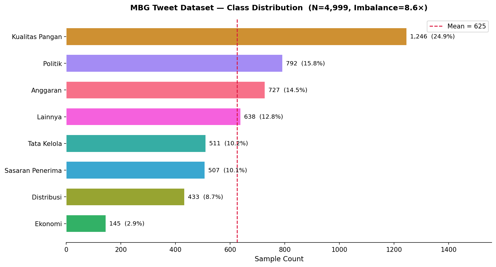

# **Satria Data 2026 - Big Data Challenge (Case 1: Multiclass Text Classification)**

Repositori ini berisi solusi lengkap untuk **Case 1: Multiclass Text Classification** dalam ajang Seleksi Internal Satria Data 2026. Sistem ini dibangun menggunakan arsitektur **Procedural Pipeline** berbasis Transformer untuk mengklasifikasikan opini publik di platform X terkait program *Makan Bergizi Gratis (MBG)* ke dalam 8 aspek substantif.

---

## **Anggota Tim**
* Muhammad Abil Hasan
* Kevin Jonathan Rotty
* Yan Adhinaya Ardika

---

## **Ringkasan Metodology & Arsitektur**
Untuk mencapai nilai *Balanced Accuracy* yang optimal dan kokoh terhadap *class imbalance* ekstrem pada data UGC (User Generated Content), tim kami menerapkan *framework* berikut:

1. **Pre-trained Language Model (PLM):** Menggunakan `indolem/indobertweet-base-uncased` yang secara *native* memahami karakteristik linguistik Twitter Indonesia (slang, typo, singkatan).
2. **Imbalance Handling:** Mengintegrasikan *Weighted Cross-Entropy Loss* ke dalam fungsi loss PyTorch berdasarkan frekuensi sampel efektif untuk mencegah dominasi kelas mayoritas.
3. **Validation Strategy:** Menggunakan *Stratified 10-Fold Cross-Validation* (proporsi 90:10 per lipatan) demi memastikan stabilitas evaluasi akademis.
4. **Ensemble Strategy:** Menyaring *Top Folds* yang memiliki selisih (delta) $\le$ 0.05 dari skor *Balanced Accuracy* tertinggi, kemudian melakukan *Soft Voting Ensemble* (merata-ratakan probabilitas logits) untuk prediksi akhir.

---

## **Hasil Exploratory Data Analysis (EDA)**

Berikut adalah visualisasi sebaran kelas data berlabel (5.000 tweet) yang menunjukkan adanya ketimpangan kelas substantif:



---

## **Persyaratan Sistem & Instalasi**

Pastikan Anda memiliki lingkungan Python $\ge$ 3.8 dan runtime GPU (sangat direkomendasikan menggunakan lingkungan Kaggle Notebook / Google Colab dengan GPU T4 atau P100).

Instal seluruh dependensi pustaka dengan menjalankan perintah berikut:
```bash
pip install -r requirements.txt